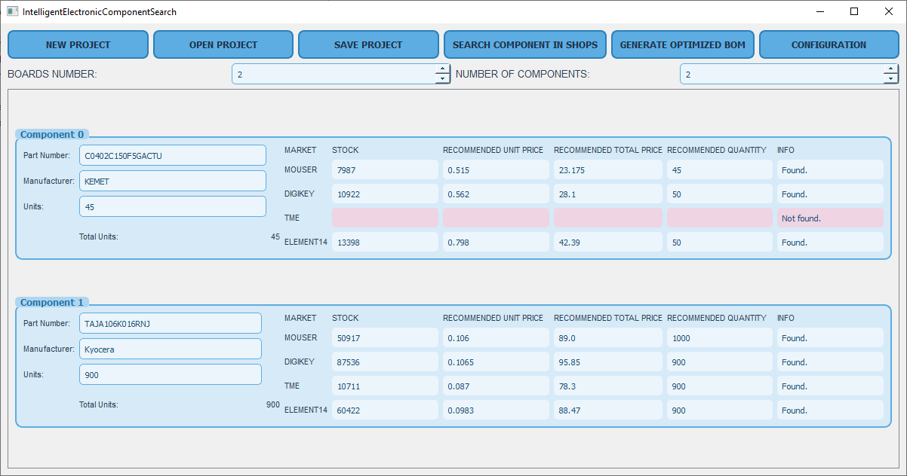

# Intelligent Electronic Component Search 



## Overview

This project is an intelligent system for searching electronic components through APIs from major electronic component retailers. The tool allows users to check stock availability and pricing from different stores for the components and quantities requested. By doing so, it helps reduce costs significantly by identifying the most affordable options across various suppliers.

## Features

- **Smart Component Search:** Query multiple online component stores for real-time stock levels and prices.
- **Cost Optimization:** Analyze different stores to identify the best deals and minimize overall purchasing costs.
- **Purchase Recommendation File:** Generate a file containing recommended purchases from each store to optimize cost-efficiency based on the components and quantities required.
- **Project Management:** Allows users to create, save, and open projects with components used and the latest searches performed on them.
- **Search Components Across Markets:** Search components across different marketplaces, including **DIGIKEY**, **MOUSER**, **TME**, and **ELEMENT14**, with configurable options for each marketplace.
- **Component Price Visualization:** View components with their prices from multiple markets in a simple and user-friendly format.
- **Generate .xlsx File:** Generate an Excel file (.xlsx) containing recommended purchases to reduce costs.

## How It Works

The tool interacts with various APIs from leading electronic component suppliers, retrieving data on prices and stock availability. Users input the required components and quantities, and the system processes this data to find the best pricing options. It then creates a purchase list, optimizing the costs by selecting the most cost-effective suppliers for each component.

## Benefits

- **Save Money:** Find the best prices for electronic components from a wide range of suppliers.
- **Time-Efficient:** Quickly compare prices and stock across multiple stores in a single search.
- **Easy Purchase Planning:** Automatically generate a recommended purchase list that simplifies your buying process.

## Getting Started
1. **Ensure you have Python 3 installed**

   This project requires Python 3. You can check if Python 3 is installed by running the following command:

   ```bash
   python3 --version
   ```

2. **Clone the repository**

   Clone the repository to your local machine by running:

   ```bash
   git clone https://github.com/your-username/intelligent-electronic-component-search.git
   ```

3. **Install dependencies**

   Install openpyxl and other required libraries by running the following:

   ```bash
   pip install -r requirements.txt
   ```

4. **Launch the application**

   Run the application and start searching for components!

   ```bash
   python3 main.py
   ```
   
## Quickstart

Follow these steps to quickly get started with the project:

1. **Configure the Markets:**
   - Start by clicking the **Configuration** button to add the markets you want to search in.
   - For each market, you will need to provide the necessary configuration, including the API token.
   - To obtain the token for each marketplace, register on the respective API platforms. Here are the links where you can sign up and get your API tokens (to be provided):
     - **[Market Mouser API Registration Link] - 
		https://eu.mouser.com/api-search/#signup**
     - **[Market DIGIKEY API Registration Link]** -
	 https://www.digikey.es/en/resources/api-solutions
     - **[Market ELEMENT 14 API Registration Link]** - 
		https://partner.element14.com/docs 
     - **[Market TME API Registration Link]** -
		https://developers.tme.eu/signup

2. **Create a New Project:**
   - After configuring the markets, click on **New Project**.
   - Add the components you want, specifying their **manufacturer** and the **number of units per board**.

3. **Search Components in Shops:**
   - Once the components are added, click on **Search Components in Shops** to start the search across the configured markets.
   - This search may take some time depending on the number of components and the number of markets enabled.

4. **View Results:**
   - After the search is completed, the component list will be updated with prices from each market.
   - You will receive alerts if a product does not have enough stock or is no longer recommended.

5. **Generate Optimized BOM:**
   - Finally, click on **Generate Optimized BOM** to create an Excel file (.xlsx) that provides detailed information on what to purchase from each market to minimize costs.


##  Contributing
This project is underdevelopment,contributions are welcome! Please feel free to open issues and pull requests for improvements.

## License
This project is licensed under the MIT License - see the LICENSE file for details.
